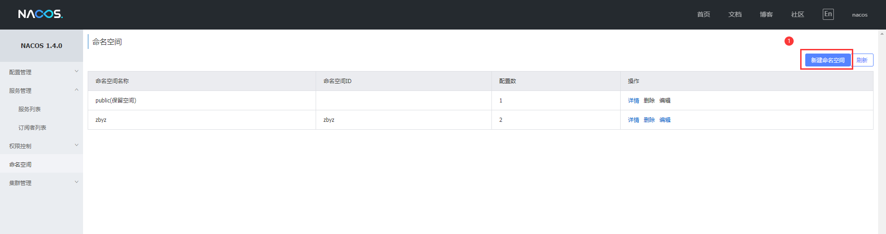
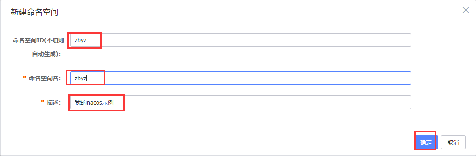
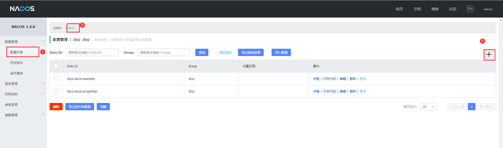
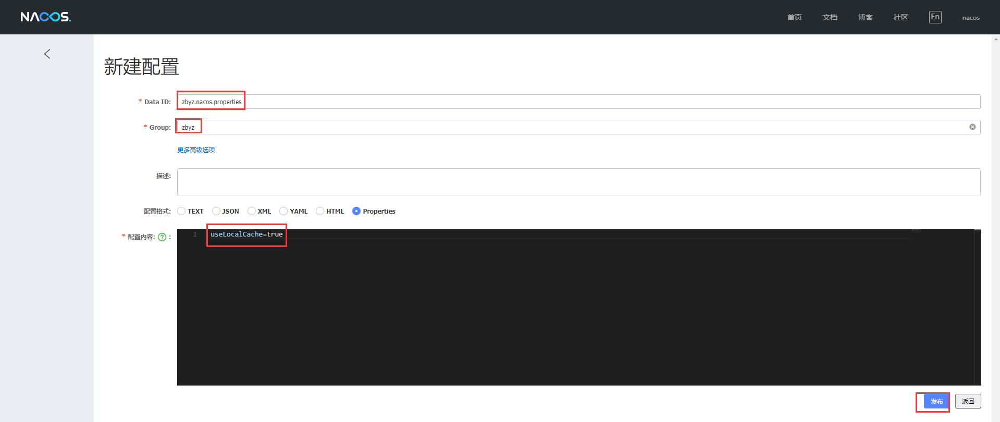

# nacos配置中心

# 本地环境

ip：192.168.227.1

jdk：1.8.0_231 X64

## [启动nacos](https://nacos.io/zh-cn/docs/quick-start.html)

## 打开nacos管理界面

http://192.168.227.1:8848/

## 配置nacos命名空间





## 新建配置





**注**:

在 Nacos Spring Cloud 中，`dataId` 的完整格式如下：

```yaml
${prefix}-${spring.profiles.active}.${file-extension}
```

- `prefix` 默认为 `spring.application.name` 的值，也可以通过配置项 `spring.cloud.nacos.config.prefix`来配置。
- `spring.profiles.active` 即为当前环境对应的 profile，详情可以参考 [Spring Boot文档](https://docs.spring.io/spring-boot/docs/current/reference/html/boot-features-profiles.html#boot-features-profiles)。 **注意：当 `spring.profiles.active` 为空时，对应的连接符 `-` 也将不存在，dataId 的拼接格式变成 `${prefix}.${file-extension}`**
- `file-exetension` 为配置内容的数据格式，可以通过配置项 `spring.cloud.nacos.config.file-extension` 来配置。目前只支持 `properties` 和 `yaml` 类型。

## 自动刷新

通过 Spring Cloud 原生注解 `@RefreshScope` 实现配置自动更新

```java
@RestController
@RequestMapping("/config")
@RefreshScope
public class ConfigController
{
    @Value("${useLocalCache:false}")
    private boolean useLocalCache;

    @RequestMapping("/get")
    public boolean get() {
        return useLocalCache;
    }
}
```

